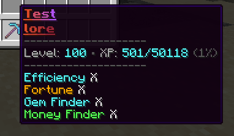
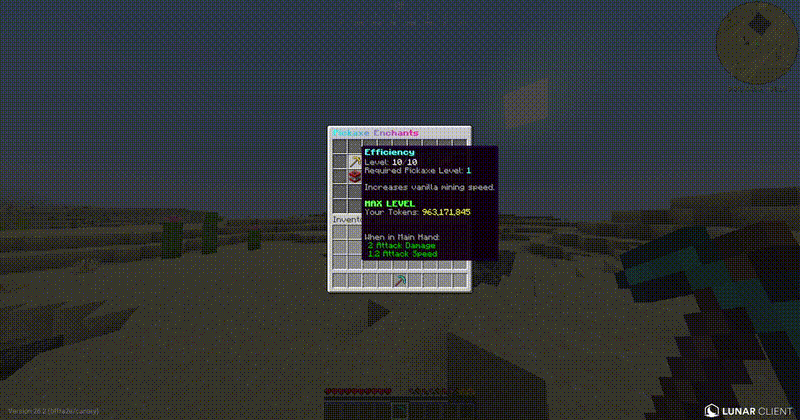
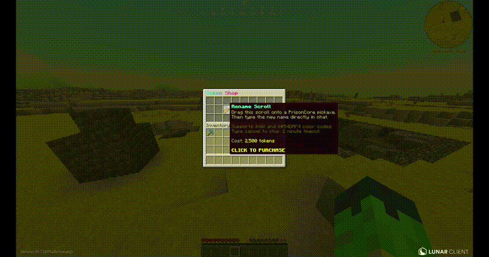
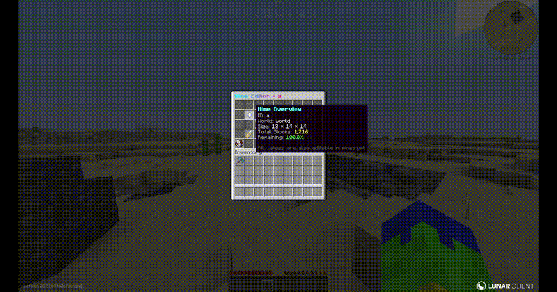

# Sean Doyle

### Software Development Portfolio

**Web Development • Mobile Applications • Backend Systems • Automation • Game Systems**

A collection of software, tools, applications, and systems I've designed and developed.

---

## About Me

I'm a developer focused on building complete, practical software systems from the initial idea through implementation and testing.

My work spans different areas of development, including web platforms, mobile applications, backend systems, automation, server tools, and game systems.

I focus on creating software that is functional, organized, maintainable, secure, and easy for people to use.

---

# Featured Projects

## ⛏️ PrisonCore

**Advanced prison progression and gameplay system for Minecraft Paper servers.**

`Java 21` `Paper` `Maven` `Adventure` `MiniMessage` `Persistent Data`

PrisonCore is a custom gameplay framework built around persistent player progression, upgradeable pickaxes, custom enchantments, token rewards, configurable mines, and administrative tools.

The project was designed as a complete system rather than a collection of individual commands. Player progression, custom item data, rewards, GUIs, persistence, and administrative controls work together through a modular backend.

### Pickaxe Progression

Each player's pickaxe maintains persistent progression data including its level, XP, and custom enchantments.

  

The system supports:

- Persistent level and XP progression
- Efficiency and Fortune progression
- Custom Gem Finder enchantment
- Custom Money Finder enchantment
- Persistent item data
- Configurable progression requirements
- Automatic lore and item-state updates

### Custom Enchantment System

Players can manage and upgrade their pickaxe through an interactive enchantment interface.

  

The enchantment system connects directly with player progression and the plugin's token economy rather than relying on vanilla enchanting alone.

### Token Economy & Shop

PrisonCore includes its own token-based progression economy and interactive shop.

  

Tokens can be earned through gameplay and used within the progression system, allowing rewards and upgrades to remain separate from a server's normal economy.

### Mine Administration

Administrative tools allow mines and gameplay systems to be managed without requiring staff to manually modify plugin data.

  

### Key Features

- Custom pickaxe progression
- XP and leveling system
- Custom enchantment framework
- Token economy
- Interactive token shop
- Configurable mine system
- Persistent player and item data
- Reward systems
- Administrative tools
- Adventure/MiniMessage interface
- Configurable gameplay behavior
- Unit-tested progression calculations

### Engineering Highlights

PrisonCore was built with long-term expansion and server performance in mind.

The project uses modular Java services instead of placing gameplay logic into large command or listener classes. Persistent item state uses Minecraft's Persistent Data Container, while progression calculations and gameplay systems are separated into reusable components.

Performance-sensitive operations are designed to avoid unnecessary work on the Minecraft main thread, and the project includes automated testing for important progression calculations.

**Source Code:** Private  
**Private source review available upon request.**

---

## More Projects Coming Soon

This portfolio is actively being expanded with additional projects across:

- Server and backend systems
- Web development
- Mobile applications
- Automation and tools
- Game systems

---

### Technologies

`Java` • `Paper` • `Maven` • `SQL` • `Git` • `GitHub`

Additional technologies will be added as more projects are published.

